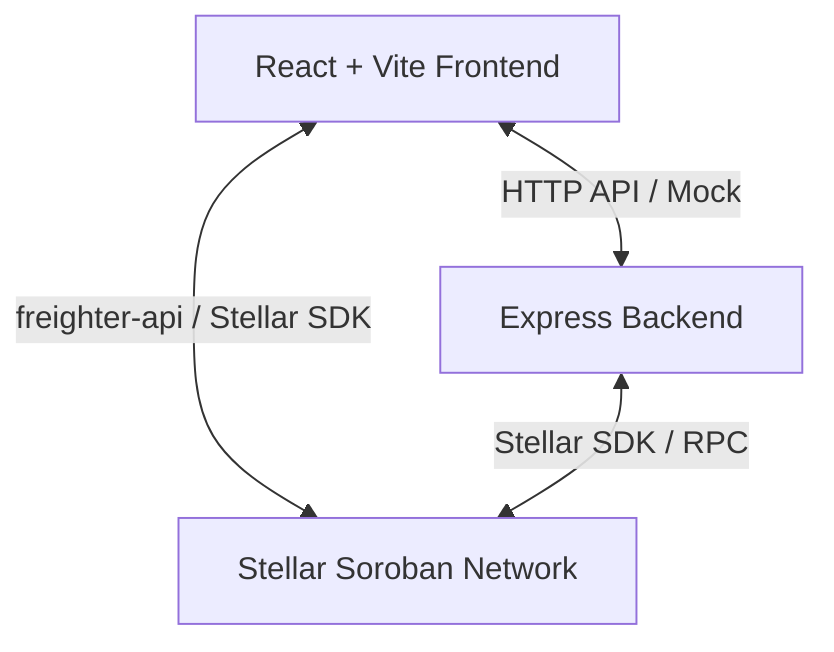

# Stellar Soroban Decentralized Voting DApp

This repository contains a high-quality, boilerplate scaffold for a full-stack Stellar Soroban DApp. It includes a frontend dashboard, an API backend server, and a Rust-based Soroban smart contract, complete with mock states so you can run the entire workspace out of the box without immediate Rust/blockchain configurations.

## Architecture Overview



1. **`contracts/voting`**: Rust-based Soroban smart contract managing polls, voting counts, and user validation on-chain.
2. **`backend`**: Express + TypeScript server caching on-chain events, managing extra poll metadata, and exposing endpoints for direct DApp queries.
3. **`frontend`**: React + TypeScript client optimized with custom CSS, dark-mode toggle, responsive layout, glassmorphism UI, and mock mechanisms.

---

## Quick Start (Mock Mode)

To run the application immediately without installing Rust, Cargo, or the Stellar/Soroban CLI, you can use the **Mock Mode** built directly into the codebase.

1. **Install workspace dependencies**:
   ```bash
   npm run install:all
   ```

2. **Run both Frontend and Backend concurrently**:
   ```bash
   npm run dev
   ```

3. Open your browser to **`http://localhost:5173`** to access the dashboard.
   - The backend runs at `http://localhost:5001`.
   - The UI runs at `http://localhost:5173`.

---

## Smart Contract Integration (Local Sandbox Network)

Once you want to compile and deploy the smart contract on a local Stellar network, follow these instructions:

### Prerequisites

1. **Install Rust and Cargo**:
   Follow instructions at [rustup.rs](https://rustup.rs/).
2. **Add WASM target**:
   ```bash
   rustup target add wasm32-unknown-unknown
   ```
3. **Install Stellar CLI**:
   ```bash
   cargo install --locked stellar-cli --features opt
   ```

### Compile & Deploy Contract

1. **Build the smart contract**:
   ```bash
   cd contracts
   cargo build --target wasm32-unknown-unknown --release
   ```
   This generates the Wasm file in `target/wasm32-unknown-unknown/release/voting_contract.wasm`.

2. **Start a local Stellar sandbox**:
   ```bash
   stellar network container start local
   ```

3. **Deploy the contract**:
   Create a local deployment identity and deploy the compiled `.wasm` file:
   ```bash
   stellar keys generate --network local alice
   stellar contract deploy \
     --wasm target/wasm32-unknown-unknown/release/voting_contract.wasm \
     --source alice \
     --network local
   ```
   This will output a **Contract ID** (e.g. `CCX...`).

4. **Link Backend to Contract**:
   Update `backend/.env` with your contract ID and local RPC:
   ```env
   PORT=5001
   STELLAR_RPC_URL=http://localhost:8000/soroban/rpc
   STELLAR_NETWORK_PASSPHRASE="Standalone Network ; February 2017"
   VOTING_CONTRACT_ID="YOUR_CONTRACT_ID_HERE"
   MOCK_MODE=false
   ```
   Restart your backend and run again!

---

## Folder Structure

```
├── backend/                  # TypeScript Express API server
│   ├── src/
│   │   ├── controllers/      # API entry route handlers
│   │   ├── services/         # Stellar RPC & Mock handlers
│   │   ├── app.ts            # Express configurator
│   │   └── server.ts         # Server entry point
│   ├── package.json
│   └── tsconfig.json
├── contracts/                # Soroban Rust contracts
│   ├── voting/               # Main voting contract
│   │   ├── src/              # lib.rs & unit tests
│   │   └── Cargo.toml
│   └── Cargo.toml            # Rust workspace Cargo config
├── frontend/                 # React & Vite client
│   ├── src/
│   │   ├── components/       # Premium React widgets (glassmorphism UI)
│   │   ├── hooks/            # useSoroban hook for contract state
│   │   ├── services/         # API clients
│   │   ├── App.tsx           # Dashboard dashboard controller
│   │   ├── index.css         # CSS Variables styling system (glassmorphism, dark/light)
│   │   └── main.tsx          # Client entry point
│   ├── package.json
│   └── vite.config.ts
├── package.json              # Root script orchestrator
└── README.md
```
